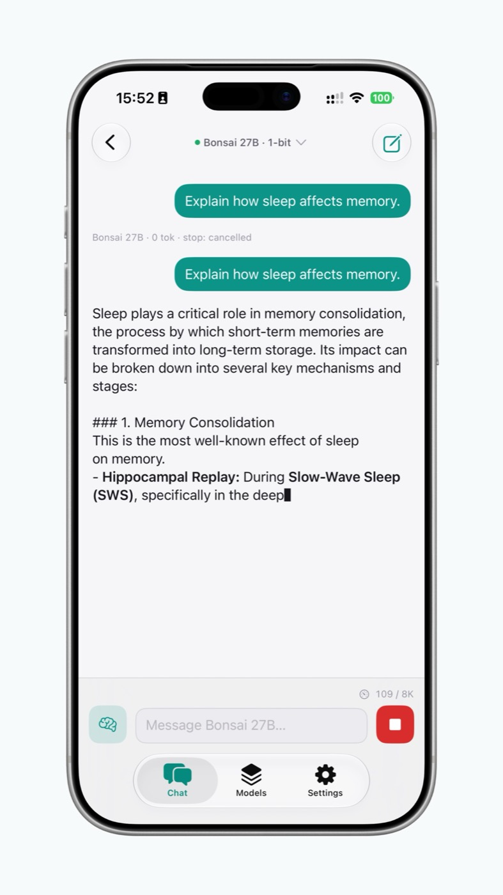

<div align="center">


# mobileLLM

**A private, open-source chat app that runs open-weight language models fully on your device** —
macOS + iOS, pure Swift + [MLX](https://github.com/ml-explore/mlx-swift). No account, no cloud;
nothing you type ever leaves the device.



</div>

## What it is

- **On-device chat** with open-weight LLMs, streamed token-by-token, with collapsible reasoning.
- **A model catalog** you download and switch between — each model shows an honest per-device memory
  **fit badge**, so you know what will actually run well on your hardware before downloading it.
- **Built to host many model families.** Adding a family is a catalog entry, not a rewrite.

## Models

The catalog is designed to grow to **many open-weight families**. Each model shows its own provider
and license on its card in the app. The first family included is **Bonsai** (Qwen3.5 / Qwen3, 1-bit
and ternary quantizations) — more families are on the roadmap.

## Architecture

Two inference engines behind **one protocol**, so the UI, model manager, downloader, and
memory/thermal governance are engine-agnostic:

- **MLX engine** — Mac and small-to-mid models today.
- **llama.cpp engine** *(planned)* — memory-mapped weights, so large models fit on memory-tight
  phones (the mmap'd weights don't count against the per-app dirty-memory limit).

See **[docs/DESIGN.md](docs/DESIGN.md)** for the full architecture, model catalog, and roadmap, and
**[docs/WIRING.md](docs/WIRING.md)** for the 1-bit dependency notes.

## Build

Universal SwiftUI app (macOS 14 / iOS 17). The Xcode project is generated from `project.yml` with
[XcodeGen](https://github.com/yonaskolb/XcodeGen):

```sh
brew install xcodegen
cp Signing.xcconfig.example Signing.xcconfig   # add your Apple Developer Team ID
xcodegen generate
open mobileLLM.xcodeproj
```

Build with **`xcodebuild`** (MLX's Metal kernels require it). The MLX-free packages
(`AppUI` / `AppRuntime` / `LLMCore`) also run a fast `swift test`.

## License

App source: **[MIT](LICENSE)**. Each model keeps its own license (shown in the app).
