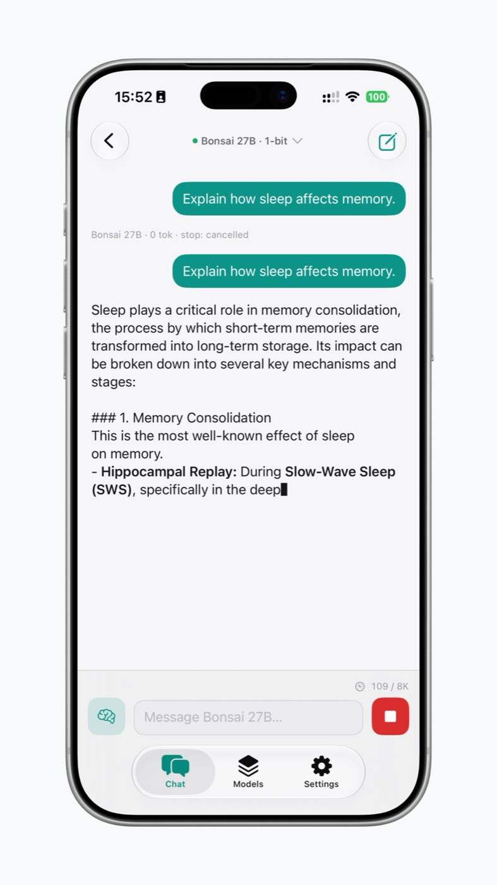

<div align="center">


# mobileLLM

**A private, open-source agent chat app for macOS + iOS** — native Swift + SwiftUI. Open-weight models
run fully on your device behind one protocol (Apple [MLX](https://github.com/ml-explore/mlx-swift),
[llama.cpp](https://github.com/ggml-org/llama.cpp), and Apple Intelligence's own on-device model), with an
optional OpenAI-compatible **online model** path for testing and high-quality API models. A durable agent
runtime (runs, journal, approvals, subagents, workflows) sits above the engines. No account and no
telemetry: inference and chat storage stay on your device. Network access happens only for model
discovery/downloads, online models you enable and approve, or tools you explicitly enable (web, Wikipedia, MCP).

<p>
  <a href="LICENSE"></a>
  <a href="https://github.com/nanguoyu/mobileLLM/actions/workflows/ci.yml"></a>
  
  
  
</p>

<!-- Hero image. To refresh, replace assets/screenshot.jpg in place (same path/name) — nothing else
     references it. -->


</div>

## Features

- 🔒 **On-device by default.** Inference, chats, memories, skills, attachments, and downloaded weights stay
  on your device — no account and no telemetry. Model downloads, explicitly enabled network tools, and
  online models you enable and approve are the documented exceptions; see **Privacy and network boundary** below.
- 💬 **Streamed chat with thinking disclosure.** Tokens stream one by one; for reasoning models the `<think>`
  trace shows in a disclosure that auto-collapses to "Thought for Ns" when the answer starts (or always-expand / hidden).
- ⚡ **Three engines, one protocol.** **MLX** (resident weights), **llama.cpp** (memory-mapped GGUF), and
  **Apple Intelligence** (the OS's own model, on eligible devices) all conform to a single `LLMEngine`; a
  `RoutingEngine` keeps at most one resident. Pick the engine per model, or let **Auto** choose the greenest
  fit for your device.
- 🍎 **Apple Intelligence as a zero-download model.** On a device with it enabled, the system model shows up
  in the model list at 0 bytes — nothing to download, and it always fits, because the OS holds the weights
  outside our process. When it isn't available the card says exactly why (turned off, not eligible, still
  downloading) instead of pretending. Requires iOS 26 / macOS 26; the app still builds and runs on iOS 17 /
  macOS 14, where the framework is weak-linked and simply absent.
- 📊 **Honest memory fit + a model-aware context ladder.** Every model shows a per-device fit badge
  (*Runs great* / *Tight* / *High memory · may fail*) from your hardware profile, and the context-length options are
  capped by what the model was trained for and re-scored per rung — a setting that buys memory, not capability.
  Local engines cooperatively check cancellation, memory pressure, and iOS thermal state at decode boundaries.
- 🛠️ **Agent runtime + tool calling + MCP.** Every send is a durable **agent run** behind a frozen-input,
  journaled, recoverable runtime (spec `spec.md`): each external operation passes a
  `prepare → authorize → execute` boundary with immutable capability ceilings, budgets, approvals, and a
  replayable journal. The real toolbox includes keyless **web search** (five engines: DuckDuckGo, Bing
  RSS, Brave, Yahoo, Marginalia — no API key), a **webpage reader** (readable-text extraction with SSRF
  guards), Wikipedia, calculator, clock — plus permission-gated **calendar, reminders and location**
  tools. The chat's Tools submenu shows a master authorization plus a checkmark for every built-in
  capability; the full Tool Settings screen adds descriptions, search-engine priority, and remote **MCP**
  controls (Streamable HTTP, per-server enable + per-tool mute). Tool access is off by default, only
  selected tools are advertised to the model, and tool results are framed as **untrusted data**
  (prompt-injection fenced) before another model pass.
- 🧩 **Subagents + parallel tool batches + dynamic workflows.** The runtime can spawn bounded
  subagents with attenuated ceilings, run tool batches in parallel inside one run, and orchestrate a
  message-anchored **workflow** (`/workflow <goal>`): a planner decomposes the goal into phases
  (explore → plan → audit → revise → verify → deliver fallback), fans out subagents per phase, passes
  structured handoffs between phases, and shows live x/y progress, tokens, and tool-call counts.
- 🌐 **Online models (OpenAI-compatible Responses API).** Add any number of services (base URL, model
  id, API key in the device Keychain only); one active service routes the conversation to the provider.
  Per-conversation: approval (see below), reasoning on/off + effort (low/medium/high), context length,
  sampling, and an **Auto output budget** that lets the service use the model's own maximum.
- 🛂 **Three per-conversation approval modes** — **Ask** (every external operation), **Safe preset**
  (app-internal/read-class actions auto-approved, network/data-egress actions asked), and **Full access**
  (auto-approve within the run's immutable ceiling). The mode and reasoning effort live in a persistent
  bottom control bar above the composer and can be switched in place; approval cards dock immediately
  above the composer while a run waits.
- ⏱️ **iOS lifecycle.** iOS 17 background-drain quiescence keeps runs resumable, and on iOS 26 the app
  uses BGTaskScheduler **continued processing** (fail-if-not-immediately-runnable, GPU-aware) so an
  already-authorized run can finish in the background without silently resuming later.
- ☰ **Conversation overflow menu.** The top-right action is an overflow menu (•••), not New Chat:
  Rename / Delete / Add to Project (pure tag grouping), workspace pages (Workflow, Terminal, Files,
  Background tasks), and per-conversation Settings (reasoning + effort, approval mode, context length,
  sampling, online output budget). Unimplemented workspace pages get a real empty-state page, never a
  dead menu item.
- 🧠 **Memory you can read and correct.** Tell it something worth keeping and it notes it down; the notes
  relevant to your question are folded into the prompt before it answers, so memory works without the model
  having to remember to look. Everything it saved is listed in Settings → Behavior → Memory — who wrote each
  note (it or you) and when — where you can edit, delete, add your own, or forget everything. On-device,
  like the rest.
- 🖼️ **Image input (vision GGUF models).** Attach photos (picker or paste, up to 3, downscaled to 1568 px
  JPEG on-device) and ask about them — Qwen3.5 and Gemma 4 run their official `mmproj` projector through
  llama.cpp's mtmd. The photo button appears only when the active model can actually see.
- 🎤 **Dictation.** A mic button in the composer transcribes speech into the draft via Apple's speech
  recognizer, on-device where supported; long-press to pick the recognition language (System / 中文 /
  English — one recognizer is bound to one language). A camera capture option sits beside the photo
  library and paste in the composer's [+] menu.
- ✨ **Skills — reusable instruction packs.** Five built-ins (Translator, Proofreader, Code Explainer,
  Researcher — which teaches the search→read→cite tool chain — and Concise Mode) plus your own; activate
  one per conversation from the composer's [+] menu and the thread remembers it. **Compatible with
  [AI Edge Gallery community skills](https://github.com/google-ai-edge/gallery/discussions/categories/skills)**:
  import any `SKILL.md` by URL or paste, export yours in the same format (skills that need the Gallery's
  `run_js` JS runtime are flagged honestly — that runtime isn't on iOS yet). Browse and share more in
  **[Discussions → Skills](https://github.com/nanguoyu/mobileLLM/discussions/categories/skills)**.
- 🧵 **Conversations remember their model.** Every send stamps the thread with the model that answered;
  explicitly reopening a thread restores that selection. Relaunch always stops at the conversation list
  with no history selected and never allocates model weights merely to show the UI; the first send performs
  the real load. There is no "default model" setting to manage — a new chat starts on whatever you used
  last, and the empty-state title ("Chat with … ⌄") is itself the model picker.
- 🧭 **Explore — live Hugging Face browse.** Search `mlx-community` (MLX) and the GGUF orgs (bartowski,
  unsloth, ggml-org, lmstudio-community) by download count, pick a precision, and install. Community models
  load from their own chat template, so they're clearly flagged **Unverified**. Family and license are
  mapped only from Hub metadata the app recognizes; missing metadata stays **Unknown**, never guessed.
- 🧩 **Many model families.** 12 curated models across 5 families ship in the Featured catalog; adding one
  is a catalog entry, not a rewrite. Downloads are **revision-aware**, resumable, verify Hub LFS SHA-256, and
  report live bytes/speed/ETA across every required file, including a vision projector.
- 🎨 **Native SwiftUI, ink-wash design.** Tabs & sheets on iOS, sidebar & menu bar on macOS; a warm
  rice-paper / cinnabar-seal (水墨) palette, Dynamic Type, dark mode, reduce-motion.

## Models

The **Featured** catalog ships **12 models across 5 families**, every size/layer/quant figure taken from a
Hugging Face primary source. Each model's own license shows on its card in the app. The **Explore** tier
adds hundreds more live from the Hub.

| Model | Family · Publisher | Params | Quantizations (on-disk) | Engine(s) | License |
|---|---|---|---|---|---|
| Bonsai 27B | Bonsai · Prism ML | 27B ᴴ | 1-bit 5.1 GB · ternary 8.5 GB · GGUF 3.8 GB | MLX + llama.cpp | Apache-2.0 |
| Bonsai 8B | Bonsai · Prism ML | 8B | 1-bit 1.3 GB · ternary 2.3 GB · GGUF 1.2 GB | MLX + llama.cpp | Apache-2.0 |
| Bonsai 4B | Bonsai · Prism ML | 4B | 1-bit 0.6 GB · ternary 1.1 GB · GGUF 0.6 GB | MLX + llama.cpp | Apache-2.0 |
| Bonsai 1.7B | Bonsai · Prism ML | 1.7B | 1-bit 0.3 GB · ternary 0.5 GB · GGUF 0.2 GB | MLX + llama.cpp | Apache-2.0 |
| Qwen3.5 4B | Qwen · Alibaba | 4B ᴴ | Q4_K_M 2.7 GB ᵛ | llama.cpp | Apache-2.0 |
| Qwen3.5 9B | Qwen · Alibaba | 9B ᴴ | Q4_K_M 5.7 GB ᵛ | llama.cpp | Apache-2.0 |
| Qwen3.6 27B | Qwen · Alibaba | 27B ᴴ | Q4_K_M 16.8 GB | llama.cpp | Apache-2.0 |
| Hunyuan 4B | Hunyuan · Tencent | 4B | Q4_K_M 2.6 GB | llama.cpp | Tencent Hunyuan Community |
| DeepSeek-R1 Qwen3 8B | DeepSeek | 8B | Q4_K_M 5.0 GB | llama.cpp | MIT |
| Gemma 4 E2B | Gemma · Google | ~2B ᴹ | Q4_K_M 3.1 GB ᵛ | llama.cpp | Gemma Terms of Use |
| Gemma 4 E4B | Gemma · Google | ~4B ᴹ | Q4_K_M 5.0 GB ᵛ | llama.cpp | Gemma Terms of Use |
| Gemma 4 12B | Gemma · Google | 12B | Q4_K_M 7.4 GB ᵛ | llama.cpp | Gemma Terms of Use |

<sub>Sizes are decimal GB (bytes ÷ 10⁹), rounded. **ᴴ** hybrid Gated-DeltaNet (qwen3_5) — only the
full-attention layers grow a KV cache, so memory stays near-constant as context grows. **ᴹ** Gemma
MatFormer "effective" size. **MLX 1-bit** needs the PrismML fork kernel; **ternary 2-bit** is upstream MLX;
**GGUF** runs on llama.cpp. **ᵛ** vision-capable: the app downloads the model's official `mmproj`
projector alongside the weights (adds 0.16–1 GB) and the composer accepts image attachments.</sub>

## Privacy and network boundary

The model runs locally. Conversation text, reasoning, memory, skills, image attachments, settings, and
downloaded weights are stored locally and are not uploaded by the chat engine. The app has no account,
analytics, or telemetry service.

The following user-initiated features do use the network:

- **Models:** Explore metadata and model-weight downloads contact Hugging Face.
- **Built-in network tools:** web search, webpage reading, and Wikipedia send the model-selected query or
  URL to those public services. Each can be deselected independently; none is available while the master
  tool authorization is off.
- **MCP:** enabling a server sends JSON-RPC requests and tool arguments to the exact remote endpoint the
  user configured. MCP tokens are stored in the device Keychain.

Tool output is treated as untrusted data before it is returned to the model. See
**[SECURITY.md](SECURITY.md)** for the downloader integrity guarantees and network threat boundary.

## Architecture

Ten Swift packages, MLX quarantined to one of them:

```
mobileLLM.app  (Xcode target — build via xcodebuild)
├── AgentContracts   versioned run/step/approval/budget/plan contracts          (MLX-free)
├── AgentRuntime     durable agent executor, journal, approvals, subagents,     (MLX-free)
│                    parallel tools, workflow orchestrator, online Responses    (sqlite3)
├── AgentSandboxAPI  protocol-only sandbox seam (no provider in OSS build)      (MLX-free)
├── MobileLLMUI      SwiftUI chat / models / settings + @Observable stores       (MLX-free)
├── LLMEngineMLX     the MLX engine — resident weights, PrismML 1-bit fork      (Metal)
├── LLMEngineLlama   the llama.cpp engine — mmap'd GGUF, vendored xcframework  (Metal)
├── LLMEngineApple   the Apple Intelligence engine — weak-linked, no weights   (MLX-free)
├── LLMCore          catalog + schema, RoutingEngine, governor, legacy tools/MCP, (MLX-free)
│                    context policy, Explore, ThinkSplitter, LLMEngine protocol
├── AppRuntime       downloader, memory/thermal governors, durable store       (MLX-free)
└── AppUI            ink-wash design tokens + shared controls                   (MLX-free)
```

Three engines behind one `LLMEngine` protocol, fronted by a `RoutingEngine` that keeps at most one resident —
so the UI, downloader, and governance are engine-agnostic and unit-testable against a mock. The eight
MLX-free packages keep a fast `swift test` loop; only the two local-weight engines need the Metal toolchain.

- **MLX engine** — resident weights via the PrismML 1-bit fork; the fastest path on Mac.
- **llama.cpp engine** — memory-mapped GGUF, so large models fit on memory-tight phones (clean, file-backed
  weight pages are reclaimable and don't count like anonymous dirty memory against the iOS jetsam limit).
  It vendors a prebuilt `llama.xcframework` (mainline llama.cpp, Metal embedded); it isn't committed —
  regenerate it with `scripts/build-llama-xcframework.sh`.
- **Apple Intelligence engine** — the OS's own model via `FoundationModels`. No weights, no download, no
  Metal: the framework is weak-linked and every use is gated behind `#if canImport` + `@available(iOS 26,
  macOS 26, *)`, so the package targets the repo's own iOS 17 / macOS 14 floor and is simply inert on older
  systems. Availability decides whether the model is "installed" — never a disk probe. Because a test can't
  even name the framework's types below macOS 26, every decision it makes is a pure function over plain
  types (`SystemModelStatus`, `AppleChatMapping`, `SnapshotDiffer`), leaving the gated code as translation —
  so its suite runs anywhere, with no Apple Intelligence required.

See **[docs/ARCHITECTURE.md](docs/ARCHITECTURE.md)** for the current package graph, routing, governor,
tools/MCP, and design tokens, and **[docs/WIRING.md](docs/WIRING.md)** for the 1-bit fork + llama.cpp
dependency wiring. **[docs/DESIGN.md](docs/DESIGN.md)** is the original design record, kept for history.

## Build

Universal SwiftUI app (macOS 14 / iOS 17), Swift 6, **Xcode 16 or newer**. The Xcode project is generated
from `project.yml` with [XcodeGen](https://github.com/yonaskolb/XcodeGen); the llama.cpp engine needs a
vendored XCFramework that isn't committed, so a fresh clone builds it first.

```sh
# 1. Tooling (Homebrew)
brew install xcodegen cmake

# 2. Build the llama.cpp XCFramework — REQUIRED (it's gitignored). Needs Xcode + CMake;
#    produces a ~355 MB artifact at Packages/LLMEngineLlama/Vendor/llama.xcframework and
#    takes ~15–25 min the first time (a full multi-platform llama.cpp build).
./scripts/build-llama-xcframework.sh

# 3. Signing — copy the template and add your Apple Developer Team ID (Signing.xcconfig is gitignored).
#    The app bundle identifier is versioned in project.yml.
cp Signing.xcconfig.example Signing.xcconfig

# 4. Generate and open the project.
xcodegen generate
open mobileLLM.xcodeproj
```

Build the app with **Xcode / `xcodebuild`** (MLX's Metal kernels require it). Inference (the 1-bit MLX
kernels and GGUF Metal) is validated on **real devices** — the simulator has no Metal path for it.

For a fast inner loop, the eight MLX-free packages need none of the above and run under plain SwiftPM:

```sh
swift test --package-path Packages/AppUI
swift test --package-path Packages/AppRuntime
swift test --package-path Packages/LLMCore
swift test --package-path Packages/AgentContracts
swift test --package-path Packages/AgentRuntime
swift test --package-path Packages/AgentSandboxAPI
swift test --package-path Packages/MobileLLMUI
swift test --package-path Packages/LLMEngineApple
```

Two xcodebuild-only suites remain: `-scheme EngineTests` runs the engine packages' unit tests (the MLX
package's macros can't build under plain SwiftPM), and `-scheme UITests` drives the iOS simulator
(keyboard/composer geometry, agent-run UI, workflow E2E). The checked-in test plans live in
`Verification/AgentHarness/TestPlans` (`SimulatorUI.xctestplan`, `DeviceE2E.xctestplan`); online-model
scenarios read `~/.mobilellm/openai.json` through launch-environment variables (see below).

See **[CONTRIBUTING.md](CONTRIBUTING.md)** for the full development setup and package map.

## OpenAI-compatible online models (developer setup)

Online models are a per-service configuration: **Settings → Online models** lets you add multiple
OpenAI-compatible Responses API services (name, base URL, model id, optional declared max output
tokens), store each API key in the device Keychain (this-device-only, off-backup), and activate one.
Developer/test machines can seed the same configuration from one file **outside the repository**:
`~/.mobilellm/openai.json` (`apiKey`, `baseURL`, `model`), created once with:

```sh
scripts/setup-openai-config.sh
```

It is written `chmod 600` and never committed. macOS DEBUG builds read it directly; simulator and
physical-device UI tests forward it through the `MOBILELLM_OPENAI_API_KEY`,
`MOBILELLM_OPENAI_BASE_URL`, and `MOBILELLM_OPENAI_MODEL` launch-environment variables, and the DEBUG
app seeds the key into the device Keychain (this-device-only, off-backup). Keys are never written to
Settings or `UserDefaults`.

To actually route chat through the service, open Settings → Online models, add/select a service, store
its key, and toggle **Use online model**. The next message is sent to the configured endpoint; like
other external operations, data egress asks for approval once per conversation under the selected
approval mode (Ask / Safe preset / Full access). The base URL may point at any OpenAI-compatible
gateway — only `https` is accepted.

## Community

[**GitHub Discussions**](https://github.com/nanguoyu/mobileLLM/discussions) is the place for ideas, questions, and skills:

- 🧩 **[Skills](https://github.com/nanguoyu/mobileLLM/discussions/categories/skills)** — share a `SKILL.md`
  (or a link to one) and anyone can import it into the app; a post template collects the summary, the
  skill body, and whether it needs the `run_js` runtime. Compatible with AI Edge Gallery skills.
- 💡 **Ideas** — models, tools, or engines you'd like to see.
- 🙏 **Q&A** — build issues, model fit, usage help.

Bugs and concrete feature requests still go to [Issues](https://github.com/nanguoyu/mobileLLM/issues).

## License

App source: **[MIT](LICENSE)**. Each model keeps its own license (shown in the app). Model weights
downloaded at runtime are not part of this project.
